[中文文档](doc_resources/README_cn.md)

## Camera-LiDAR-Calibration Manual

This solution provides a method for manually calibrating the extrinsic parameters between Livox LiDAR  and camera, which has been verified on series Mid-40, Horizon and Tele-15. It includes the calibration of camera intrinsic parameters, obtaining of calibration data, the calculation of extrinsic parameters between camera and LiDAR,  and some examples of camera LiDAR fusion application. In this solution, the board corners are used as calibration targets. Thanks to the non-repetitive scanning characteristics of Livox LiDAR, we can find the accurate position of corner in high density point cloud more easily. At the same time, we can get a better calibration result and a better LiDAR camera fusion.

Use the following link to download an example of data, which is used to calibrate the intrinsic and extrinsic parameters. The data is already saved in the default path.

[Data example](https://terra-1-g.djicdn.com/65c028cd298f4669a7f0e40e50ba1131/Download/update/data.zip)

### Step1: Environment configuration

(The following calibration process is under the Ubuntu 64-bit 16.04 environment)

#### 1.1 Install environment and driver

Install the ROS environment，install [Livox SDK](https://github.com/Livox-SDK/Livox-SDK) and [livox_ros_driver](https://github.com/Livox-SDK/Livox-SDK-ROS). You can skip this step if they are already installed.

```
# install Livox_SDK
git clone https://github.com/Livox-SDK/Livox-SDK.git
cd Livox-SDK
sudo ./third_party/apr/apr_build.sh
cd build && cmake ..
make
sudo make install

# install livox_ros_driver
cd ..
git clone https://github.com/Livox-SDK/livox_ros_driver.git ws_livox/src
cd ws_livox
catkin_make
```

#### 1.2 Install dependencies

You can skip this step if they are already installed.

- [PCL installation](http://www.pointclouds.org/downloads/linux.html)

- [Eigen installation](http://eigen.tuxfamily.org/index.php?title=Main_Page)

- [Ceres-solver installation](http://ceres-solver.org/)

#### 1.3 Download source code and compile

```
# install camera/lidar calibration package
cd src
git clone https://github.com/Livox-SDK/livox_camera_lidar_calibration.git
cd ..
catkin_make
source devel/setup.bash
```

#### 1.4 Program nodes briefs

This project includes the following nodes:

- cameraCalib - calibrate the camera intrinsic parameters

- pcdTransfer - transfer the LiDAR rosbag to PCD files

- cornerPhoto - obtain the corner of the photo

- getExt1 - node1 to calculate the extrinsic parameters(optimize only the extrinsic) 

- getExt2 - node2 to calculate the extrinsic parameters(optimize the intrinsic and extrinsic together)

- projectCloud - project the LiDAR point cloud on the photo

- colorLidar - give color to the LiDAR point cloud

You can find the corresponding launch file in src/calibration/launch folder if you want to modify any launch file.

### Step2: Calibration of camera intrinsic parameters

#### 2.1 Preparations

Prepare a calibration chessboard (as shown below, which can be printed out).

<div align=center>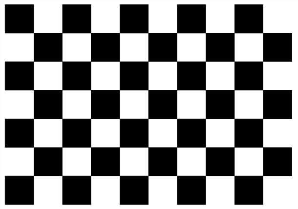</div>

Install MATLAB to calculate the extrinsic parameters, or use cameraCalib node.

Parameters adjustment

Make sure that the selected camera has a pinhole imaging model. At first, please adjust the basic parameters(including the focus and photo dimension, etc) of the camera itself. In this case we use the [Livox Horizon Lidar](https://www.livoxtech.com/horizon) and [Haikang Industrial Camera MV-CE060-10UC](https://www.hikrobotics.com/vision/visioninfo.htm?type=42&oid=2627) , as shown in the figure below. To ensure that the field of view of the photo and the field of LiDAR point cloud are consistent, the photo dimension needs to be modified according to the FOV(field of view) of LiDAR, the Horizon ’s FOV is 81.7 (horizontal) x 25.1 (vertical), so the photos used in this case have a dimension of 1520 (width) x 568 (height) pixels.

<div align=center>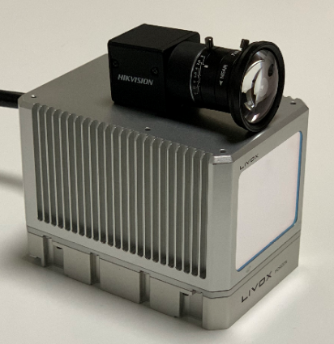</div>

#### 2.2 MATLAB calibration

This method needs to install MATLAB to calculate the results, if you don't want to use  MATLAB, please refer to 2.3.

Normally you need to prepare more than 20 photos, which should cover all the FOV. In order to get a better result, please keep a distance of 3 meters when shooting. As shown in the following figure.

<div align=center></div>

We use the tool "cameraCalibrator" of MATLAB, it can get the following results, we need the first, second, and eleventh data.

<div align=center>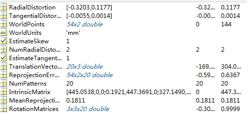</div>

#### 2.3 cameraCalib calibration

(You can skip this step if you have already used 2.2 MATLAB calibration)

Configure the corresponding path and parameters in cameraCalib.launch after getting the photo data. The default path is to put the photo data under data/camera/photos, and write the corresponding photo names in data/camera/in.txt, as shown in the following figure.

<div align=center>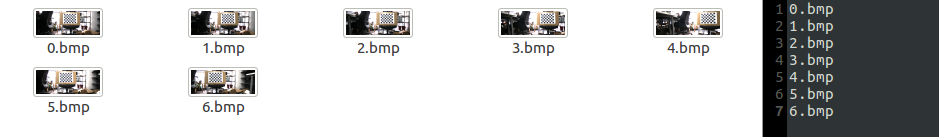</div>

Then run the command to start calibrating

```
roslaunch camera_lidar_calibration cameraCalib.launch
```

The calibration results will be saved in data/camera/result.txt, including reprojection errors, intrinsic parameters and distortion correction parameters.

#### 2.4 Calibration result

1. A 3x3 intrinsic matrix (IntrinsicMatrix) [[Note 1]](#notes)
2. Five parameters for correcting distortion, k1, k2, p1, p2, k3

### Step3: Preparations and data collections

#### 3.1 Calibration scene preparation

In our project, we use the four corner points of the calibration board as the target points [[Note 2]](#notes). It will be better to select a relatively empty environment for the calibration scene, to facilitate the identification of the calibration board and to ensure that the LiDAR has a certain distance from the calibration board. In this case, a calibration board(1x1.5m) made of low-reflectivity foam is used. We need to select at least 10 different angles and distances to place the calibration board (similiar to the placement in camera intrinsic calibration), preferably 3 meters away to get better accuracy, and it is better to collect datas from different positions and different angles [[Note 3]](#notes).

<div align=center>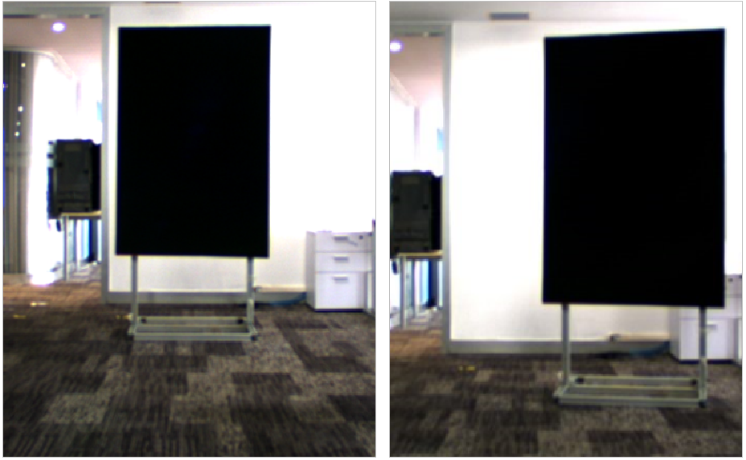</div>

<div align=center>Place calibration board at different positions and angles</div>

#### 3.2 Connect the LiDAR

Check if the board corner is in the point cloud, use command to see the point cloud

```
roslaunch livox_ros_driver livox_lidar,rviz.launch
```

Use another command when recording the rosbag

```
roslaunch livox_ros_driver livox_lidar_msg.launch
```

Please refer to the following link https://github.com/Livox-SDK/livox_ros_driver to confirm that the data format of rosbag is "customMsg", which is required for the subsequent program.

#### 3.3 Connect the camera

In this solution we use Haikang camera supervisor MVS to connect and turn on the camera, then check the photo quality and board corner in the photo.

#### 3.4 Collect the photo and LiDAR data

1. Take the photo

2. Run the command to record the point cloud

```
rosbag record /livox/lidar
```

3. Save a photo and a rosbag of 10 seconds for each data

4. After collecting all the data, put photos in data/photo folder; LiDAR rosbag in data/lidar folder.

### Step4: Calibration data acquisition

#### 4.1 Parameter setting

Firstly save the intrinsic parameters and distortion correct parameters obtained in step2 in the path data/parameters/intrinsic.txt [[Note 4]](#notes). Distortion corresponds to five distortion correction parameters, which in order are: k1, k2 (RadialDistortion), p1, p2(TangentialDistortion) and k3, normally set 0 by default.

<div align=center>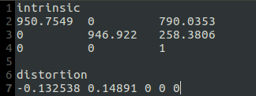</div>

#### 4.2 Acquire the corner coordinates in photo

1. Configure the launch file cornerPhoto.launch, and run

```
roslaunch camera_lidar_calibration cornerPhoto.launch
```

2. The program will open the corresponding photo [[Note 5]](#notes). On this UI interface, you can move the mouse to each corner of the calibration board, the corresponding coordinate data will be displayed in the bottom left of the window. Take an order, generally we start with the corner point of the upper left corner, and rotate counterclockwisely to note the coordinates of the four corner points.

<div align=center>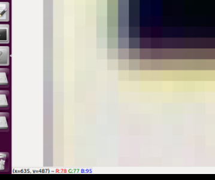</div>

3. Select the displayed picture and press a random key to enter the coordinate input process. Enter the four corners “x y” in order, and there must be a space between x and y (for example: “635 487”). After that, enter “0 0” to end the input process (as shown in the figure below). The program will calculate four points in more precise float type, and save them in default path data/corner_photo.txt. Then press a random key to end the whole process.

<div align=center>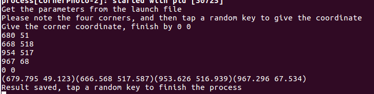</div>

4. Change the path in cornerPhoto.launch, repeat the process until all the corner coordinates of photo are acquired.

#### 4.3 Acquire the corner coordinates in point cloud

1. Check the rosbag path in pcdTransfer.launch, set the number of rosbag, and name the rosbag  0.bag, 1.bag...etc.

2. Run the command to convert the rosbag to PCD files in batches, they will be saved in defaut path data/pcdFiles.

```
roslaunch camera_lidar_calibration pcdTransfer.launch
```

3. Use the PCL visualization program to open the PCD files, hold shift + left click to get the selected point coordinates [[Note 6]](#notes), please keep the same order of corner as the photos.

```
pcl_viewer -use_point_picking xx.pcd
```

4. Save the xyz coordinates in the data/corner_lidar.txt by the following format of all the PCD files.

<div align=center>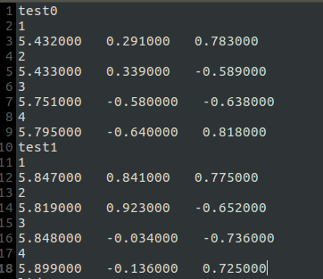</div>

You can also use other point cloud visualization programs than pcl_viewer to obtain the corner coordinates.

### Step5: Extrinsic calculation

#### 5.1 Parameter setting

Extrinsic calculation node will read the calibration data in data/corner_photo.txt and data/corner_lidar.txt to calculate the extrinsic parameters, the data needs to be saved in a specific format to be correctly read by this node. Referring to the figure below, only the data with more than 10 letters in one line will be read as a calculation data, the title such as the 1 2 3 4, lidar0 and 0.bmp will not be read as calculation data. The program will stop reading the data and start calculating when it reads blank lines.

<div align=center>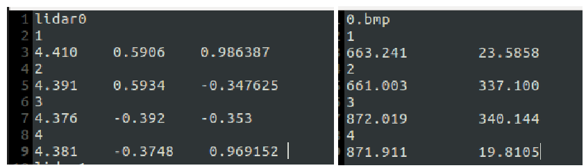</div>

Before the calculation, check the calibration data to make sure that each line corresponds to the same corner and the data amount is the same [[Note 7]](#notes).

#### 5.2 Calculation node getExt1

Configure the initial extrinsic value in the getExt1.launch file first [[Note 8]](#notes), then run the command to calculate the extrinsic parameters.

```
roslaunch camera_lidar_calibration getExt1.launch
```

The cost of each iteration operation will be printed out on the terminal, and the result will be saved in the path data/parameters/extrinsic.txt in the format of homogeneous matrix

<div align=center>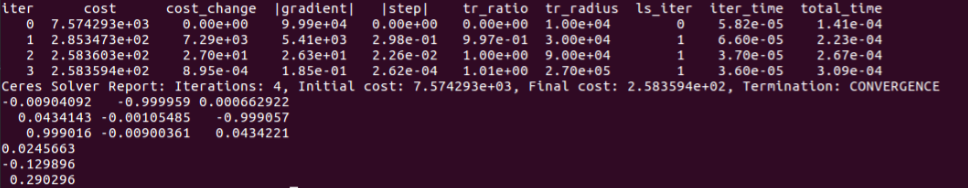</div>

We can evaluate the obtained extrinsics parameters by the cost of optimization and reprojection error [[Note 9]](#notes).

The data with large error will be printed on the terminal during the reprojection, we can redo the calculation after this outlier detection.

#### 5.3 Calculation node getExt2

The node getExt1 only optimizes extrinsic parameters, while the node getExt2 will optimize the intrinsic and extrinsic parameters together. Run the command to get new intrinsic and extrinsic matrixs and do the reprojection with the new parameters.

```
roslaunch camera_lidar_calibration getExt2.launch
```

Normally the node getExt1 can get a good result, but if the result obtained always has a large cost after the initial value is verified and the outlier detection, we can try the node getExt2. Make sure the data amount is large before using this node, and well verify the result obtained.

If the result obtained by getExt2 is better after the verification, update the new intrinsic parameters in data/parameters/intrinsic.txt.

### Step6: Results verification and related applications

#### 6.1 Briefs

After obtaining extrinsic parameters, we can use two common applications to see the fusion result. The first one is the projection of the point cloud on the photo, the second one is the point cloud coloring [[Note 10]](#notes). 

#### 6.2 projection of point cloud on the photo

Set the rosbag and photo path in the projectCloud.launch file, run the command to project a certain number of point cloud on the photo

```
roslaunch camera_lidar_calibration projectCloud.launch
```

<div align=center>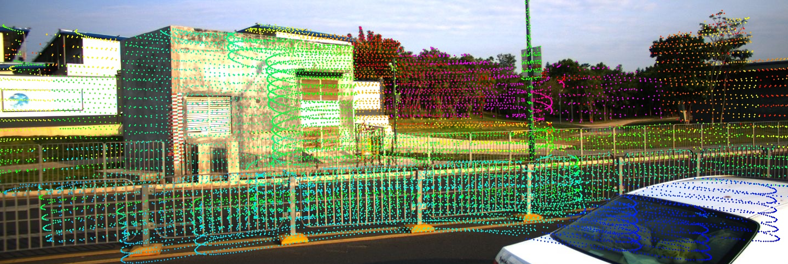</div>

<div align=center>Photo projection</div>

#### 6.3 Point cloud coloring

Set the rosbag and photo path in the colorLidar.launch file, run the command and check coloring rendering in the rviz.

```
roslaunch camera_lidar_calibration colorLidar.launch
```

<div align=center>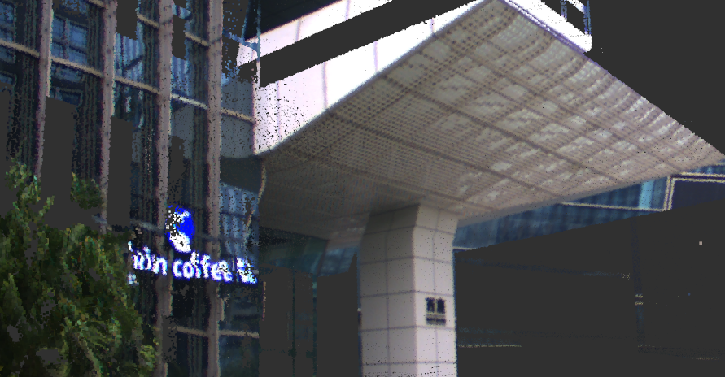</div>

<div align=center>Coloring rendering</div>

### Notes

1. The format of the intrinsic matrix is shown in the following figure. Generally, there are values in four positions of the matrix (0,0); (0,2); (1,1); (1,2).

<div align=center>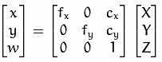</div>

2. The basic principle of calibration is to calculate and obtain the conversion relationship between the xyz coordinates in the LiDAR coordinate system and the xy coordinates in the camera coordinate system of the same target. Because the corner point is a relatively obvious target in the point cloud and the photo, this method can reduce the calibration error.

3. We can also use multiple calibration boards or a chessboard calibration board that can be recognized by the LiDAR.

4. Be careful not to change the format, otherwise you need to modify the relevant code in the getIntrinsic() and getDistortion() functions in the common.h file in the program.

5. The displayed picture is corrected by distortion correction parameters. Please check the photo correction quality. For example, the photo correction on the left in the figure below has a problem, the distortion parameters may be set incorrectly. The photo on the right is normal.

<div align=center>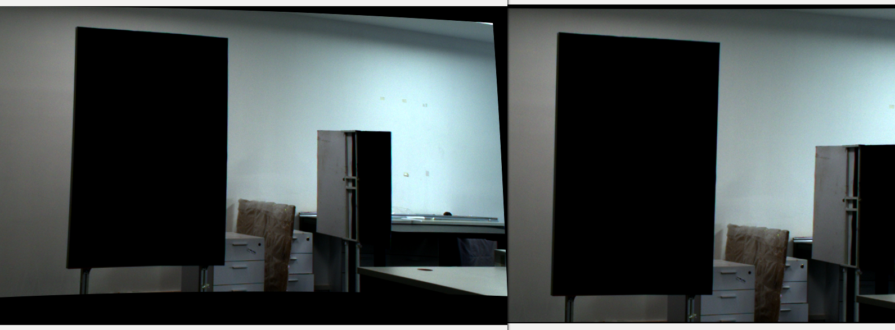</div>

6. After opening pcl_viewer, you can enter "h" in the terminal to get the guidance.

7. Note that if a line has less than 10 letters, it cannot be read as calculated data, so if the point cloud xyz or photo xy coordinates are short, you need to add up to 10 letters.

8. The default initial value in the program is set according to the coordinate system of Livox LiDAR, the relative position of the LiDAR and the camera, and should be modified according to the real situation. If the initial value is badly set, it may lead to bad optimization results.

9. If the cost is still relatively large at the end of the iteration (for example, 10 to the power of 4), it may be a problem with the initial value setting in the launch file, the result is only a local optimal solution, then the initial value needs to be reset.

10. The point cloud of the LiDAR can be projected to the corresponding position of the photo through the intrinsic and extrinsic matrix. The color of the point cloud will be displayed from blue to red to show the distance from near to distant; For the coloring, the corresponding camera pixel coordinates can be obtained by the point cloud coordinates, the intrinsic and extrinsic matrix, and the RGB information of this pixel can be assigned to the point cloud for display, so that the LiDAR point cloud can show with the real color.

